# README

### ✏️ 기본 과제 : Dockerize Project

### 📅 21.12.24

### Docker

- 컨테이너 기반 가상화 도구
- 리눅스 상에서 컨테이너 방식으로 프로세스를 격리해서 실행하고 관리할 수 있도록 지원
- 계층화된 파일 시스템에 기반해 효율적으로 이미지를 구축
- 도커 사용하여 이미지 기반으로 컨테이너 실행

### 도커를 사용해야 하는 이유

- 애플리케이션을 환경에 제한되지 않고, 실행시킬 수 있음
- 서버 운용 기록을 코드화
- 다른 사람이 만든 서버를 가져와서 사용할 수 있음
- 여러 대에 배포할 수 있는 확장성

### 도커 설치 과정

공식문서와 구글링 통해 설치

- docker pull hello-world

  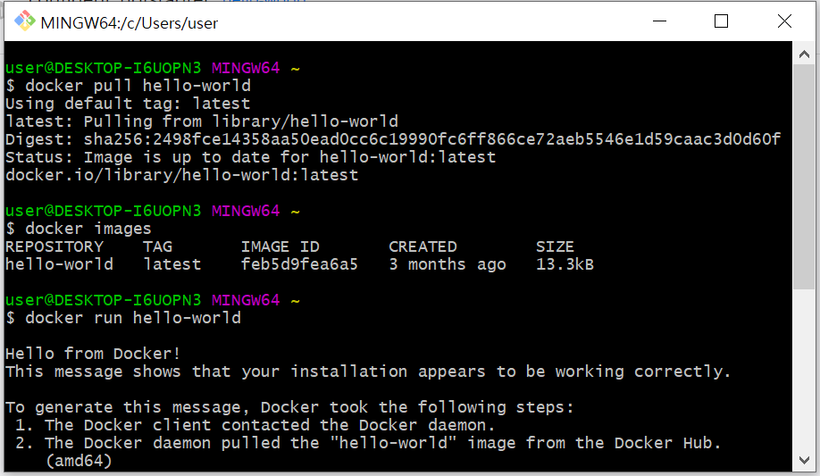

### 도커 기본 명령어 실습

- doecker ps -a

- docker rm [컨테이터 ID]

  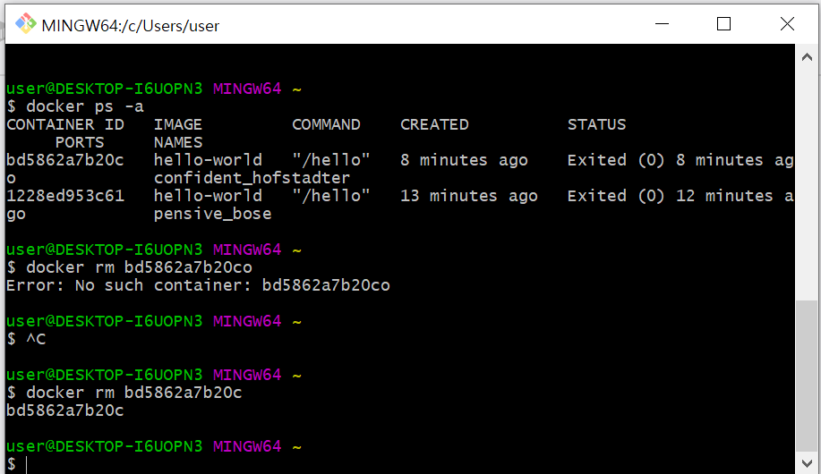

  

- docker images

  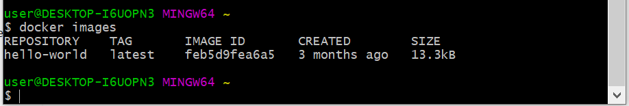

### 샘플 서비스(Jenkins)를 이용한 도커 실습

- Jenkins를 도커 컨테이너로 실행 및 실행중인지 확인

  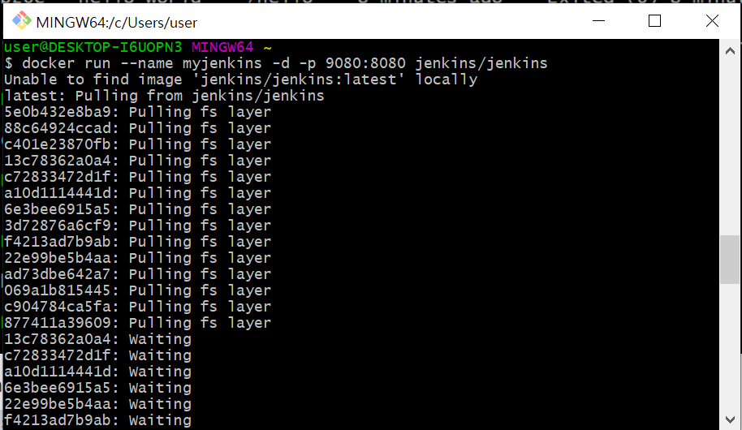

  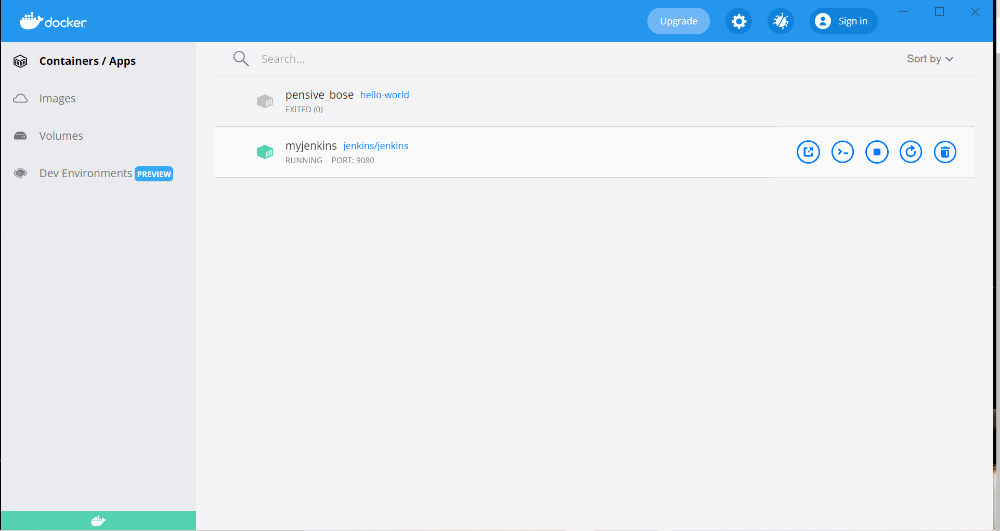

  

- Jenkins 서버 컨테이너의 os 버전 확인

  > TTY 에러 발생!!
  >
  > -> winpty 로 재실행해서 해결

  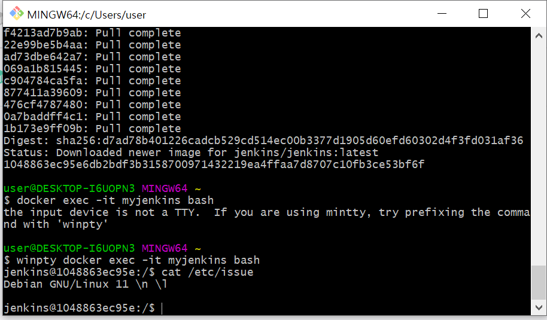

  

- Jenkins 환영 페이지 확인

  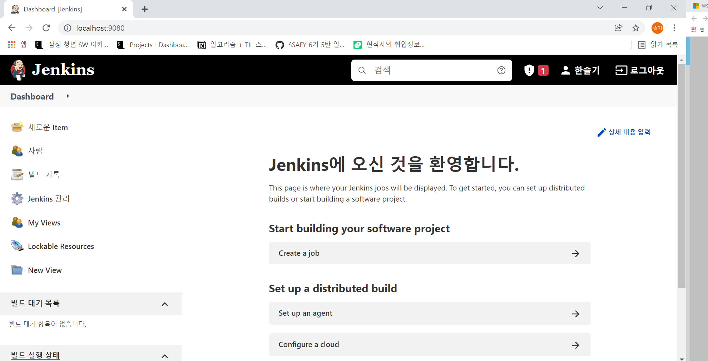

### 관통 프로젝트 프론트엔드 도커 이미지 제작

- 프론트엔드 실행 확인

- Dockfile 작성 후 프론트엔드 용 도커 이미지 빌드

  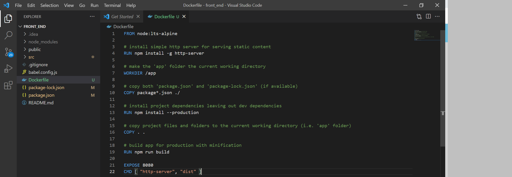

  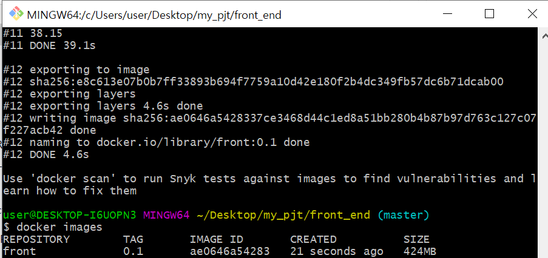

  

- docker TAG 추가하고 삭제하기

  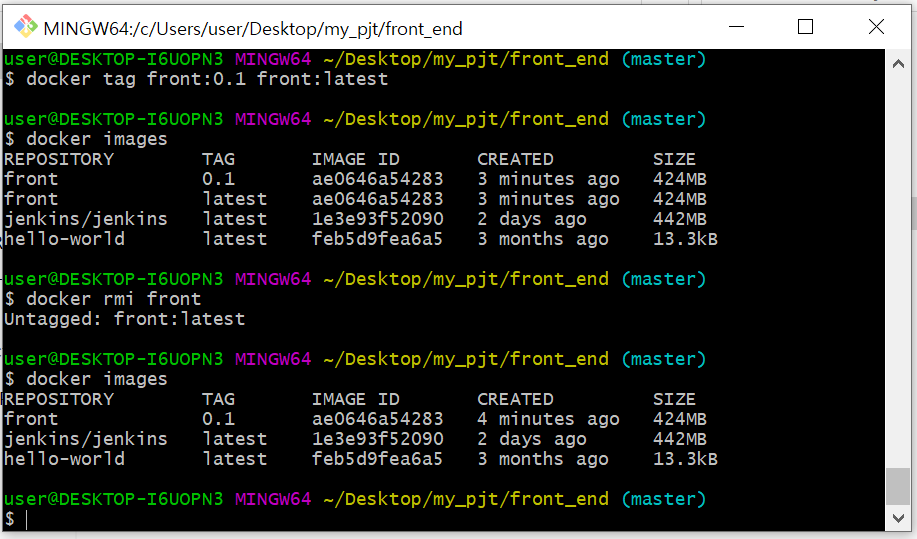

- 도커로 프론트엔드 실행 및 웹 브라우저로 접속해서 확인

  > 에러 발생!!
  >
  > `winpty docker run -it -p 80:80 --rm front:0.1` 로 실행

### 관통 프로젝트 백엔드 도커 이미지 제작

- Dockerfile 생성하고, 도커 이미지 빌드

  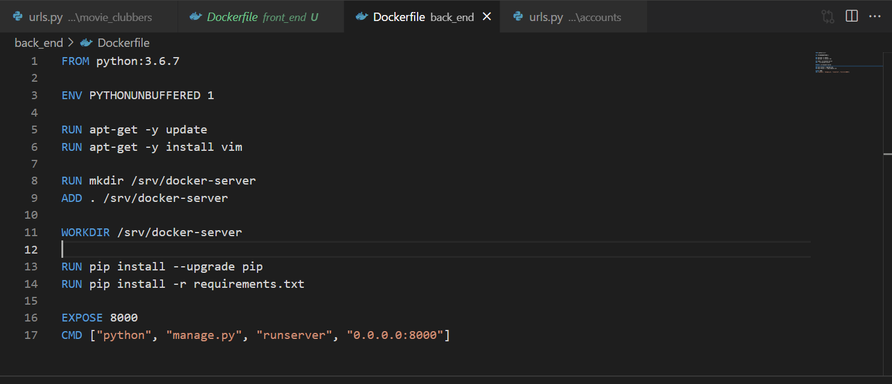

  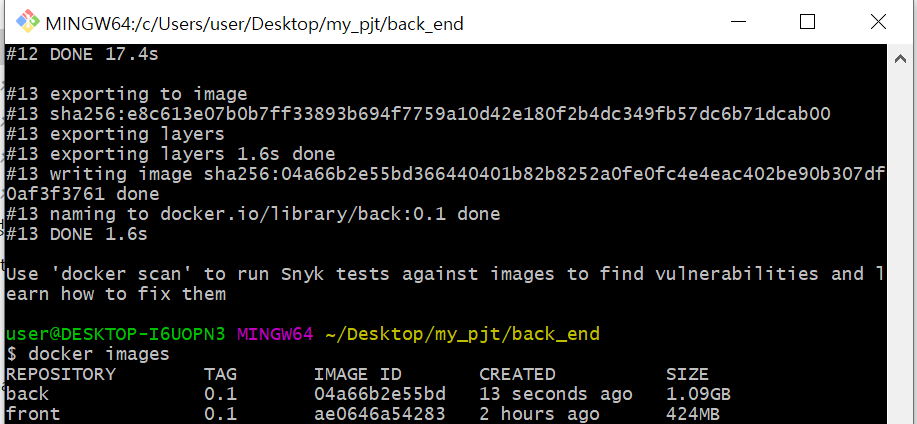

- MySQL 컨테이너 실행 및 정상 실행 여부 조회

  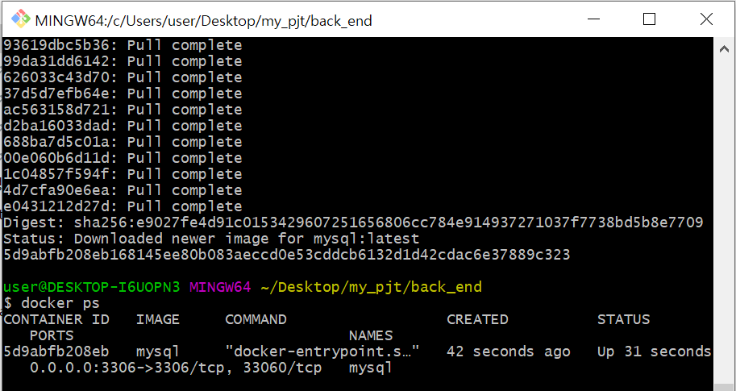

- DB 접속 테스트

  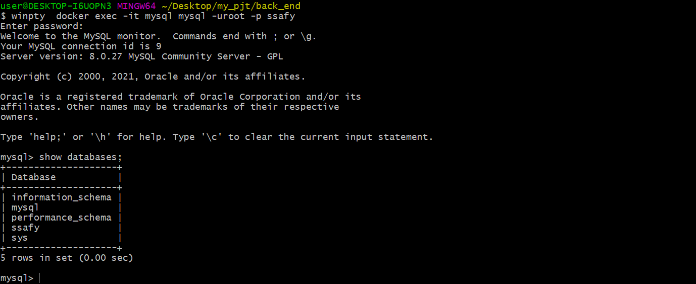

### 🙂느낀점

Docker를 처음 학습하고, 사용해봤는데 너무 어려웠다. 공식문서를 잘 따라가면서 설치했다고 생각했는데, 중간중간 에러 발생해서 구글링을 통해 해결했다. Dockerfile을 어떻게 생성하는지 몰라서 시간이 오래 걸렸는데, 처음에는 vi 명령어를 사용해서 설치했었다. 그런데 이렇게 설치하면 설치가 완벽하게 되지 않는다. 그래서 VS 코드를 통해 파일을 생성하고, 필요한 명령어들을 작성했더니 build가 원활하게 되었다. backend 부분을 할 때, DB 접속에서도 계속 에러가 발생했었다. 그런데, 시간이 지나고 다시 접속을 시도하니까 database를 볼 수 있었다. 

사실 아직 컨테이너, Dockerfile 등등 완벽하게 이해가 되지는 않는다. 사용하기까지의 과정이 복잡하고, 에러도 많이 발생했어서 잘 쓸 수 있을지 모르겠다. 하지만 배포 과정에서의 장점이나 현업에서 많이 사용할 수 있다는 부분 때문에 더 공부를 해야할 것 같다.
